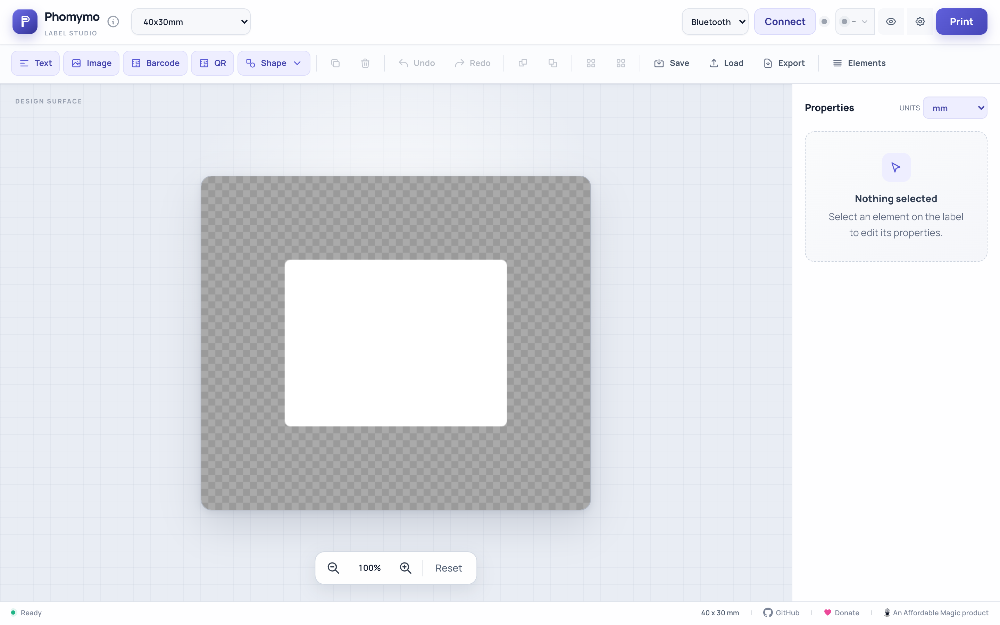
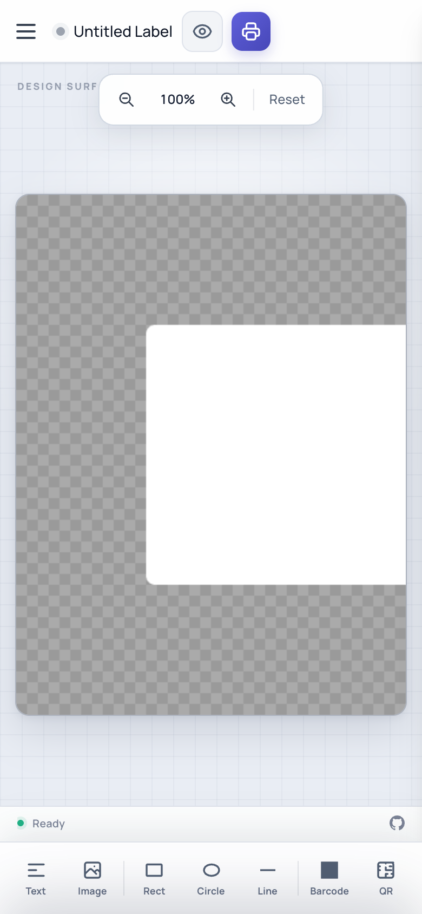

# Phomymo

A free, browser-based label designer for Phomemo thermal printers. No drivers needed - connects via Bluetooth or USB.

**Try it now: https://zachmoshe.github.io/phomymo/**
(or the original version at: https://phomymo.affordablemagic.net)

<p>
  
  
</p>

## Quick Start

1. Open https://phomymo.affordablemagic.net in Chrome (or any Chromium-based browser)
2. Click **Connect** to pair with your printer via Bluetooth (or **USB** for PM-241)
3. Design your label and click **Print**

To run locally (Web Bluetooth requires HTTPS or localhost):

```bash
cd src/web
python3 -m http.server 8080
# Open http://localhost:8080 in Chrome
```

**Requires:** Chrome, Edge, or another Chromium-based browser. Web Bluetooth is not available in Firefox or Safari. Android Chrome is supported with full touch UI; iOS is not supported. PM-241 printers require USB (WebUSB).

## Features

**Design Elements** - Text (multiple fonts including local system fonts, sizes, styles, alignment, background colors, and a Labels mode that turns words or phrases wrapped in ASCII quotes or Hebrew gershayim into automatically wrapping rounded badges), images with scale/aspect lock, barcodes (Code128, EAN-13, UPC-A, Code39), QR codes, and shapes (rectangle, ellipse, triangle, line) with transparent, solid, or dithered fills and solid, dashed, dotted, or dash-dot strokes.

**Editing** - Drag to move, corner/edge resize handles, rotation. Multi-select (Shift+click), grouping (Ctrl/Cmd+G), undo/redo, keyboard nudge, layer ordering, clipboard image paste (Ctrl/Cmd+V). Pin an element's placement to protect its position, size, and rotation while keeping its content and style editable.

**Measurement Units** - Enter exact element positions and sizes in millimetres (the default) or switch the properties panel to pixels. The unit preference is saved in the browser.

**Label Sizes** - Preset sizes for each printer type, round labels, custom dimensions. Auto-switches based on connected printer. For labels that feed through the printer vertically, keep the real physical dimensions and use **Rotate design view** to work horizontally; printing and PNG/PDF export rotate the result back automatically. Multi-label rolls support clone or individual zone modes.

**Templates & Batch Printing** - Variable fields with `{{FieldName}}` syntax, CSV import, preview grid, and batch printing with progress tracking.

**Non-printable Guides** - Mark any text, image, barcode, QR code, or shape as non-printable. Guides stay visible at 50% opacity while editing and are omitted from print previews, printing, PDF, and PNG output.

**Linked Copies for Folded Labels** - Link a copy of any text, image, barcode, QR code, or shape. Choose whether it starts beside or above/below the original, then experiment with independent Flip H, Flip V, Rotate 180°, and Reset controls. Copies start inside the label, remain freely positionable, and continue to follow the original's content, styling, size, and rotation. A purple dashed marker identifies the copy in the editor but is not printed or exported.

**Instant Expressions** - Dynamic values at print time using `[[expression]]` syntax: `[[date]]`, `[[time]]`, `[[datetime]]`, or custom formats like `[[date|MM/DD/YYYY]]`. Works in text, barcodes, and QR codes.

**Print Preview** - Toggle dither preview to see exact thermal print output before printing.

**Export** - Save/load designs to browser storage, update the currently loaded design with **Save**, duplicate or overwrite named designs with **Save As**, export/import as JSON, and export to PDF or PNG.

**Mobile** - Full-featured touch UI with pinch-to-zoom, two-finger pan, slide-up property panels, and complete feature parity with desktop.

**Printer Status** - Live battery level, paper status, firmware version, and serial number with auto-query on connect.

## Supported Printers

| Model | Width | Notes |
|-------|-------|-------|
| P12 / P12 Pro | 12mm | Continuous tape label maker |
| A30 | 12-15mm | Continuous tape, faster print speed |
| M02 / M02S / M02X | 48mm (384px) | Mini pocket printers, continuous paper |
| M02 Pro | 53mm (626px) | 300 DPI high-resolution mini printer |
| M03 | 53mm (432px) | Mini sticker printer |
| T02 | 48mm (384px) | Mini sticker printer |
| M04S / M04AS | 53/80/110mm | 300 DPI multi-width printer (select paper size in settings) |
| M110 / M120 | 48mm (384px) | Narrow label makers |
| M200 / M250 | 75mm (608px) | Mid-size labels |
| M220 / M221 | 72mm (576px) | Wide labels |
| M260 | 72mm (576px) | Wide label maker |
| D30 / D35 / D50 / D110 | 12-15mm | Smart mini label makers (rotated protocol) |
| Q30 / Q30S | 12-15mm | Similar to D30 |
| PM-241 / PM-241-BT | 102mm (4") | Shipping labels, USB only (TSPL protocol) |

The app auto-detects your printer model from the Bluetooth device name and configures the correct protocol, print width, DPI, and label presets. If auto-detection fails, you can manually select your model in Print Settings, or the app will prompt you on first connection.

D-series printers print labels rotated 90° - the app handles this automatically. PM-241 printers use Bluetooth Classic (not BLE), so use the USB connection instead.

## Custom Printer Definitions

You can add, edit, and override printer definitions through **Print Settings > Manage Printers**. This lets you:

- **Add new printers** not yet in the built-in list with your own protocol, width, DPI, and alignment settings
- **Override built-in printers** to adjust settings like alignment or width for your specific hardware
- **Set auto-detect patterns** so your custom definitions are recognized automatically by BLE device name

Custom definitions are saved in your browser's localStorage and take priority over built-ins. Modified built-in printers can be reset to defaults at any time.

Built-in definitions are loaded from `printers.json` at startup.

## Keyboard Shortcuts

| Shortcut | Action |
|----------|--------|
| `Ctrl/Cmd + Z` | Undo |
| `Ctrl/Cmd + Shift + Z` | Redo |
| `Ctrl/Cmd + D` | Duplicate selected |
| `Ctrl/Cmd + G` | Group selected |
| `Ctrl/Cmd + Shift + G` | Ungroup |
| `Ctrl/Cmd + V` | Paste image from clipboard |
| `Delete / Backspace` | Delete selected |
| `Arrow keys` | Nudge by 1px |
| `Shift + Arrow keys` | Nudge by 10px |
| `Shift + Click` | Add to selection |

## Connection Tips

When the Bluetooth device picker appears, select the device showing a **signal strength indicator**. Devices listed without signal strength may be cached/ghost entries that won't connect properly.

## Project Structure

```
phomymo/
├── src/
│   └── web/
│       ├── index.html     # Main UI
│       ├── app.js         # Application logic
│       ├── canvas.js      # Canvas rendering & dithering
│       ├── elements.js    # Element management
│       ├── handles.js     # Selection handles
│       ├── storage.js     # localStorage persistence
│       ├── templates.js   # Variable substitution & CSV
│       ├── ble.js         # Web Bluetooth transport
│       ├── usb.js         # WebUSB transport
│       ├── printer.js     # Print protocols
│       ├── printers.json  # Built-in printer definitions
│       ├── constants.js   # Shared constants
│       └── utils/
│           ├── bindings.js   # Event binding helpers
│           ├── errors.js     # Error handling
│           └── validation.js # Input validation
└── README.md
```

## Acknowledgments

Protocol research and inspiration:

- [vivier/phomemo-tools](https://github.com/vivier/phomemo-tools) - CUPS driver with reverse-engineered protocol
- [yaddran/thermal-print](https://github.com/yaddran/thermal-print) - Printer status query commands
- [ooki1jp](https://github.com/vivier/phomemo-tools/issues/27#issuecomment-3850158579) - M04AS/M04S protocol reverse-engineering

Libraries: [JsBarcode](https://github.com/lindell/JsBarcode), [QRCode.js](https://github.com/davidshimjs/qrcodejs), [jsPDF](https://github.com/parallax/jsPDF)

## Support the Project

If Phomymo is useful to you, consider [making a donation](https://donate.stripe.com/7sY7sMese0182tXgn8eAg00) to support ongoing development.

## License

MIT License - see LICENSE file for details.
